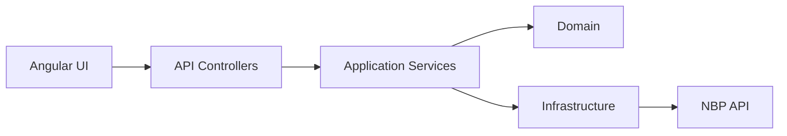

# CurrencyApp
🇬🇧 English | 🇵🇱 [Polska wersja](README_PL.md)

## Description
CurrencyApp is a full-stack application for fetching and analyzing currency exchange rates using the NBP (National Bank of Poland) API.

Backend: ASP.NET Core  
Frontend: Angular  

The application uses in-memory caching (IMemoryCache) to improve performance and reduce the number of external API calls.

---

## Running the application

### Backend
cd CurrencyApp.Api  
dotnet run  

API: https://localhost:7089  
Swagger: https://localhost:7089/swagger  

---

### Frontend
cd currency-app  
npm install  
ng serve  

Application: http://localhost:4200  

---

## Project structure

- CurrencyApp.Api – controllers, middleware  
- CurrencyApp.Application – application logic, DTOs, services  
- CurrencyApp.Domain – business logic  
- CurrencyApp.Infrastructure – external integrations (NBP API)  
- currency-app – Angular frontend  

---

## Architecture

---

## Architectural decisions
- Clean Architecture approach
- Clear separation of concerns between layers
- Domain layer contains business logic
- Application layer orchestrates the flow
- Infrastructure layer handles external APIs

---

## Design patterns

### Factory
Used to select the appropriate currency provider.

### Dependency Injection
Used across the entire application to ensure loose coupling and testability.

### Result pattern
Used to handle operation results instead of returning null or throwing exceptions.

### Middleware
Used for logging and error handling.

### Clean Architecture
Business logic is independent of frameworks and infrastructure.

---

## Frontend (Angular)
- Currency selection interface
- Date range filtering
- Communication with API using HttpClient

---

## Logging
- Serilog
- Request/response logging
- CorrelationId for request tracing
- Configurable via appsettings.json

---

## Performance & resilience
- In-memory caching (IMemoryCache)
- Cache per API type
- GetOrCreateAsync to prevent duplicate concurrent calls
- Reduced number of requests to the NBP API
- Rate limiting

---

## What I would improve in production
- Redis instead of MemoryCache
- Polly (retry, circuit breaker)
- Authentication and authorization
- Monitoring (OpenTelemetry)
- CI/CD pipeline
- Improved error handling (ProblemDetails)
- More integration tests

