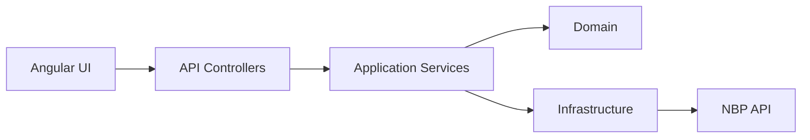

# CurrencyApp

## Opis
Aplikacja full-stack do pobierania i analizy kursów walut z API NBP.

Backend: ASP.NET Core  
Frontend: Angular  

Aplikacja wykorzystuje cache w pamięci (MemoryCache), aby poprawić wydajność i ograniczyć liczbę wywołań do API zewnętrznego.

---

## Uruchomienie

### Backend
cd CurrencyApp.Api  
dotnet run  

API: https://localhost:7089  
Swagger: https://localhost:7089/swagger  

---

### Frontend
cd currency-app
npm install  
ng serve  

App: http://localhost:4200

---

## Struktura projektu

- CurrencyApp.Api – kontrolery, middleware  
- CurrencyApp.Application – logika, DTO, serwisy  
- CurrencyApp.Domain – logika biznesowa  
- CurrencyApp.Infrastructure – integracje (NBP)  
- currency-app – frontend Angular  

---

## Architektura

---

## Decyzje architektoniczne
- Clean Architecture
- Rozdzielenie warstw
- Domain zawiera logikę biznesową
- Application zarządza przepływem
- Infrastructure obsługuje API zewnętrzne

---

## Wzorce projektowe

### Factory
Używany do wyboru odpowiedniego providera walut.

### Dependency Injection
Stosowany w całej aplikacji dla testowalności i luźnego sprzężenia.

### Result pattern
Służy do obsługi wyników operacji zamiast zwracania wartości null lub zgłaszania wyjątków.

### Middleware
Używany do logowania i obsługi błędów.

### Clean Architecture
Logika biznesowa niezależna od frameworka i infrastruktury.

---

## Frontend (Angular)
- Interfejs wyboru waluty
- Filtrowanie po dacie
- Komunikacja z API przez HttpClient

---

## Logowanie
- Serilog
- Logowanie request/response
- CorrelationId
- Konfiguracja w appsettings.json

---

## Wydajność i odporność
- Cache w pamięci (IMemoryCache)
- Cache per typ API
- GetOrCreateAsync – zapobieganie wielokrotnym wywołaniom API
- Redukcja liczby zapytań do NBP
- Rate limiting

## Co poprawić w produkcji
- Redis zamiast MemoryCache
- Polly (retry, circuit breaker)
- Autoryzacja
- Monitoring (OpenTelemetry)
- CI/CD
- Lepsza obsługa błędów
- Testy integracyjne

---